# Google Summer of Code 2026 Proposal

## Flexible Graph Construction: A Unified Pipeline for Universal Graph Topologies in Neural Weather Prediction

| | |
| :--- | :--- |
| <ul><li>**Organization:** MLLAM (Machine Learning for Limited Area Models)</li></ul> | <ul><li>**Project Length:** 350 hours (Large)</li></ul> |
| <ul><li>**Project:** [Flexible Graph Construction](https://github.com/mllam/neural-lam/wiki/GSoC-ideas#1-flexible-graph-construction) (Idea #1)</li></ul> | <ul><li>**Difficulty:** Medium</li></ul> |
| <ul><li>**Repositories:** [weather-model-graphs](https://github.com/mllam/weather-model-graphs) (WMG), [neural-lam](https://github.com/mllam/neural-lam)</li></ul> | <ul><li>**Mentors:** Hauke Schulz ([@observingClouds](https://github.com/observingClouds)), Leif Denby ([@leifdenby](https://github.com/leifdenby)), Joel Oskarsson ([@joeloskarsson](https://github.com/joeloskarsson))</li></ul>

---

## Table of Contents

1. [About Me](#1-about-me)
2. [Community Engagement](#2-community-engagement)
3. [Project Abstract](#3-project-abstract)
4. [Motivation & Problem Statement](#4-motivation--problem-statement)
5. [Current Architecture Deep-Dive](#5-current-architecture-deep-dive)
6. [Proposed Solution & Technical Design](#6-proposed-solution--technical-design)
7. [Advanced Research Contributions (Layers 4 & 5)](#7-advanced-research-contributions-layers-4--5)
8. [Weekly Timeline](#8-weekly-timeline)
9. [Testing Strategy](#9-testing-strategy)
10. [Deliverables](#10-deliverables)
11. [Risk Mitigation](#11-risk-mitigation)
12. [References](#12-references)
13. [Other Commitments](#13-other-commitments)

---

## 1. About Me

| Field | Details |
|-------|---------|
| **Name** | Prajwal [Your Last Name] |
| **GitHub** | [prajwal-tech07](https://github.com/prajwal-tech07) |
| **University** | [Your University] |
| **Degree / Year** | [e.g., B.Tech Computer Science, 3rd year] |
| **Expected Graduation** | [e.g., May 2027] |
| **Email** | [your.email@example.com] |
| **Timezone** | UTC+5:30 (IST) |
| **Available hours/week** | 30–35 hours |

[Write 2–3 paragraphs about your academic background, relevant coursework (graph theory, ML, numerical methods, atmospheric science), programming experience, and why this project excites you.]

**Key technical skills directly relevant to this project:**
- **Graph neural networks:** PyTorch Geometric, custom `MessagePassing` layers, `HeteroData` objects
- **Computational geometry:** Delaunay triangulation, Voronoi diagrams, convex hulls, spectral mesh analysis (`scipy.spatial`)
- **Scientific Python:** numpy, scipy, networkx, xarray, cartopy, pyproj
- **Software engineering:** Git branching/rebasing, pytest, CI/CD, NumPy-style docstrings

<div style="page-break-after: always;"></div>

## 2. Community Engagement

I have been actively contributing to both repositories with **substantive architectural PRs** — not cosmetic fixes:

> **Strategic Vision & Core Insight:** Bridging the gap via `HeteroData`
> Through deep engagement with the codebase and active community discussions, I conceptualized and proposed the architectural idea of "bridging the gap" between WMG and Neural-LAM by migrating to PyTorch Geometric's `HeteroData` structure. This shift—from fragmented multi-tensor storage to a unified, heterogeneous graph foundation—streamlines the graph construction pipeline and serves as the driving centerpiece of this GSoC proposal.

### 2.1 weather-model-graphs Contributions

| PR / Issue | Title | Status | Impact & Milestone |
|------------|-------|--------|---------------------|
| [**PR #81**](https://github.com/mllam/weather-model-graphs/pull/81) | `mesh_layout` two-step architecture | **Under review** *(leifdenby: "95% done, well done!")* | **Core refactor** — decouples layout & connectivity (Target: v0.4) |
| [PR #91](https://github.com/mllam/weather-model-graphs/pull/91) | `mesh_layout='prebuilt'` support | Open | Enables arbitrary mesh injection (Target: v0.5) |
| [PR #92](https://github.com/mllam/weather-model-graphs/pull/92) | `mesh_layout='triangular'` (Delaunay) | Open | Enables non-rectangular meshes (Target: v0.5) |
| [Issue #97](https://github.com/mllam/weather-model-graphs/issues/97) | `validate_graph_components()` | Open | Pre-export structural validation |
| [Issue #98](https://github.com/mllam/weather-model-graphs/issues/98) | Node-ID-to-tensor-index mapping | Open | Lossless WMG ↔ neural-lam round-trips |

### 2.2 neural-lam Contributions

| PR | Title | Status | Impact |
|----|-------|--------|--------|
| [**PR #258**](https://github.com/mllam/neural-lam/pull/258) | Area weights for metric computation | **Under review** | `cos(lat)` weighting through all 6 metrics |

### 2.3 Depth of Understanding

These contributions required reading **every source file** in both repos — `create/base.py`, `coords.py`, `flat.py`, `hierarchical.py`, `save.py`, `networkx_utils.py` in WMG; `create_graph.py` (614 lines), `base_graph_model.py`, `graph_lam.py`, `hi_lam.py`, `hi_lam_parallel.py`, `utils.py`, `metrics.py`, `interaction_net.py` in neural-lam.

<div style="page-break-after: always;"></div>

## 3. Project Abstract

> *"The challenge is to explore and implement a methodology that can create well-balanced neural network grids based on different data structures, from irregularly structured atmospheric model output to sparse ship-observations."*
> — [GSoC Ideas Page](https://github.com/mllam/neural-lam/wiki/GSoC-ideas#1-flexible-graph-construction)

This project delivers a **five-layer solution**. Layers 1–3 are the **core deliverables** (guaranteed within GSoC). Layers 4 and 5 are **modular stretch goals** — each is self-contained and can be tackled independently in the final weeks once the foundation is merged.

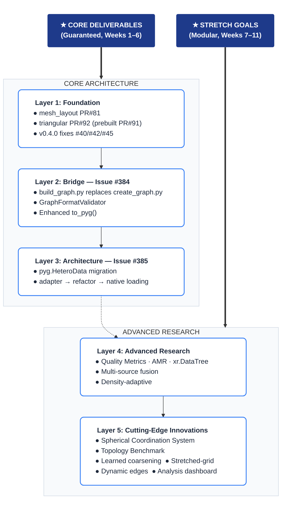

<div style="page-break-after: always;"></div>

## 4. Motivation & Problem Statement

### 4.1 The Encode-Process-Decode Architecture

neural-lam uses an **Encoder-Processor-Decoder** GNN architecture. Atmospheric variables at grid nodes are encoded into a latent space, processed on a mesh graph through multiple rounds of message passing, and decoded back to grid predictions. The architecture uses three graph components: **g2m** (grid-to-mesh encoder edges), **m2m** (mesh-to-mesh processor edges), and **m2g** (mesh-to-grid decoder edges).

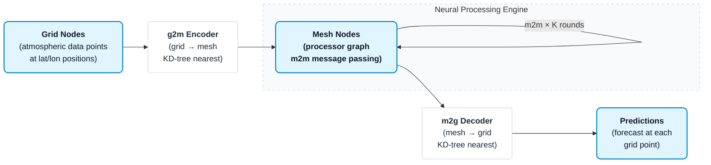

The mesh topology **directly determines** what the model can learn. The number of message-passing steps needed for information to traverse the domain equals the graph diameter. Edge features encode spatial relationships. Yet today, **only regular rectangular grids** are supported, because `create_graph.py` hardcodes `networkx.grid_2d_graph(Nx, Ny)`.

### 4.2 The Two-Step Mesh Architecture (My PR #81)

My core architectural contribution in PR #81 separates mesh creation into two independent, composable steps:

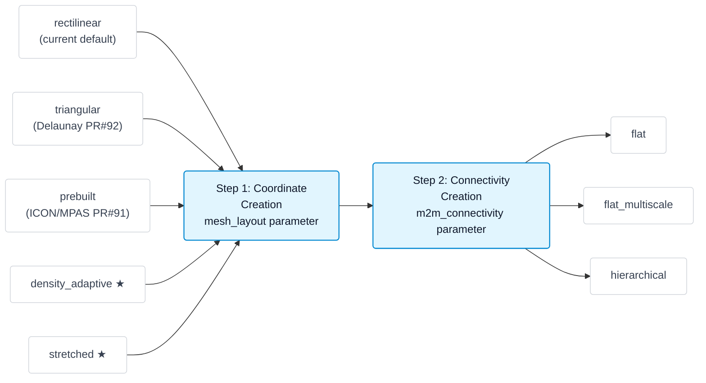

Any `mesh_layout` can combine with any `m2m_connectivity` — creating a **combinatorial explosion** of graph topologies from minimal code. This is the foundation upon which ALL other contributions in this proposal are built.

### 4.3 Current Limitations

| # | Problem | Impact | Root Cause |
|---|---------|--------|------------|
| 1 | `create_graph.py` hardcodes `nx.grid_2d_graph` | Only rectangular grids work | `networkx.grid_2d_graph(Nx, Ny)` called directly |
| 2 | 600+ lines duplicated between repos | Maintenance nightmare, divergent behavior | neural-lam reimplements WMG logic |
| 3 | `load_graph()` returns fragile `dict` | 11 raw string keys, no type safety, no validation | No `pyg.HeteroData` adoption |
| 4 | No quality evaluation for meshes | Users can't compare topologies without training | No metrics framework exists |
| 5 | Euclidean distances at high latitudes | Systematic distortion (2× at lat=60°, 5.7× at lat=80°) | No spherical coordinate support |
| 6 | No adaptive mesh refinement | Can't densify mesh in high-error regions | Static mesh construction only |

### 4.4 The Code Duplication Problem

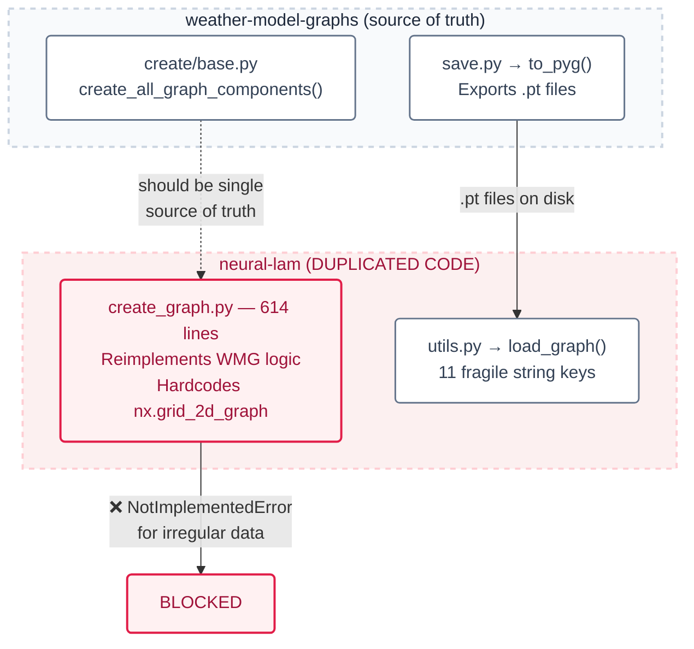

The **core blocking line** in neural-lam:
```python
# neural-lam/create_graph.py — THE line that blocks all irregular data:
grid_graph = networkx.grid_2d_graph(xy.shape[1], xy.shape[2])  # ← RECTANGULAR ONLY
# ... [remainder builds g2m/m2m/m2g from this rectangular assumption]
```

### 4.5 A Key Opportunity for Enhancement: Quality Guarantees

Once flexible meshes are enabled, a natural next step is providing a mechanism to evaluate whether a generated mesh is well-suited for message-passing. Currently, users hve no qauantitative guidance on questions like:

- Does the mesh have uniform edge-length distribution? (isotropy)
- Does the mesh cover the data domain without gaps? (coverage)
- Is the mesh well-conditioned for message-passing? (spectral gap)
- Does a denser mesh in region X actually improve prediction there? (adaptive value)

This is a natural extension of the flexible graph construction work — as a stretch goal, I propose a **Graph Quality Metrics Framework** that would give users quantitative answers to these questions before committing to expensive model training.

---

## 5. Current Architecture Deep-Dive

### 5.1 Current End-to-End Data Flow

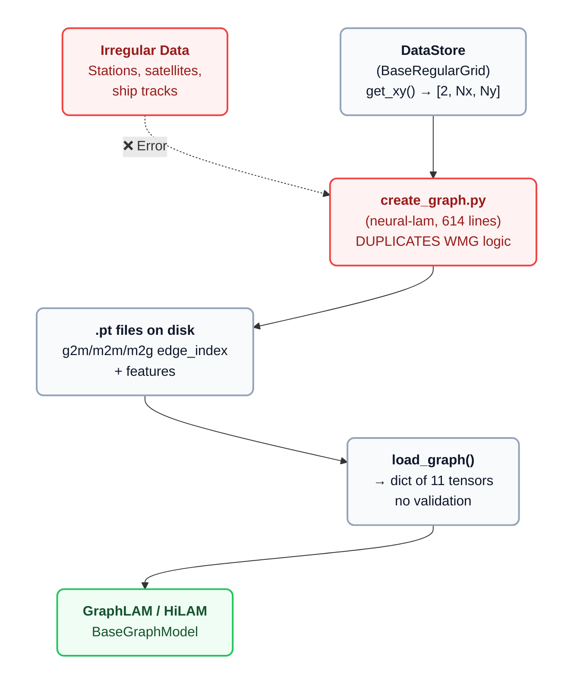

### 5.2 Data Source Support Matrix: Before vs After

| Data Type | Before | After | Layout Used |
|-----------|--------|-------|-------------|
| Regular Rectangular Grid | ✅ WORKS | ✅ WORKS | `rectilinear` (default) |
| Regular Hexagonal Grid | ❌ BLOCKED | ✅ WORKS | `triangular` |
| Reduced Gaussian Grid | ❌ BLOCKED | ✅ WORKS | `triangular` |
| ICON Icosahedral Grid | ❌ BLOCKED | ✅ WORKS | `prebuilt` / `triangular` |
| MPAS Unstructured Mesh | ❌ BLOCKED | ✅ WORKS | `prebuilt` |
| Weather Station Network | ❌ BLOCKED | ✅ WORKS | `density_adaptive` ★ |
| Satellite Swath Data | ❌ BLOCKED | ✅ WORKS | `density_adaptive` ★ |
| Ship/Buoy Observations | ❌ BLOCKED | ✅ WORKS | `density_adaptive` ★ |
| Multi-Source Blended | ❌ BLOCKED | ✅ WORKS | `multi_source` + adapt. ★ |

<div style="page-break-after: always;"></div>

## 6. Proposed Solution & Technical Design

### 6.1 Proposed End-to-End Flow (replaces Section 5.1)

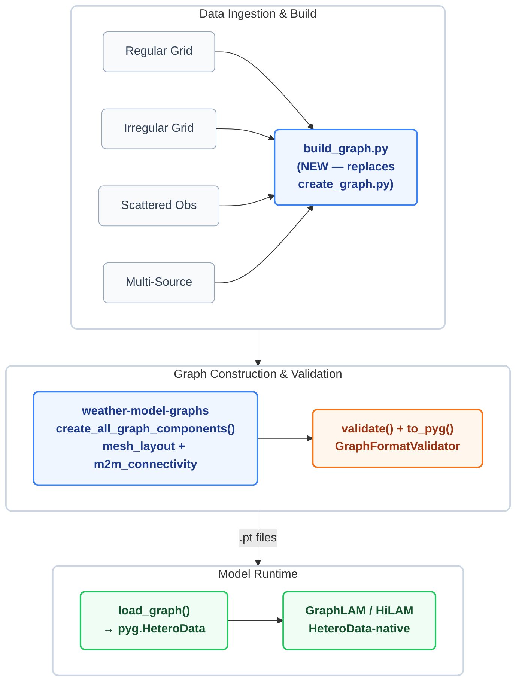

### 6.2 Layer 1: Foundation (My Existing PRs + v0.4.0 Fixes)

**PR #81 — `mesh_layout` parameter:** Decouples coordinate creation from connectivity creation. The `mesh_layout` parameter (`"rectilinear"`, `"triangular"`, `"prebuilt"`) controls WHERE mesh nodes are placed. The `m2m_connectivity` parameter (`"flat"`, `"flat_multiscale"`, `"hierarchical"`) controls HOW they are connected. This two-step architecture is the foundation for all other work.

**PR #92 — Triangular Delaunay mesh:** Adds `mesh_layout="triangular"` using `scipy.spatial.Delaunay` triangulation. This enables non-rectangular meshes for hexagonal, reduced Gaussian, and icosahedral grids.

**PR #91 — Prebuilt mesh pathway:** Adds `mesh_layout="prebuilt"` allowing users to inject arbitrary mesh node positions (e.g., from ICON or MPAS model grids).

**v0.4.0 blockers:**
- **#40 — Convex hull cropping:** `crop_mesh_to_convex_hull()` via `scipy.spatial.ConvexHull` to remove mesh nodes outside the data domain.
- **#42 — G2M assertion:** Detect and auto-fix degree-0 mesh nodes in g2m connections.
- **#45 — Level attributes:** Replace inconsistent `"level"`(int)/`"levels"`(str) with `from_level`/`to_level` (both int).

### 6.3 Layer 2: The Bridge (Issue #384)

The bridge eliminates the 600-line code duplication between repos by making neural-lam call WMG directly.

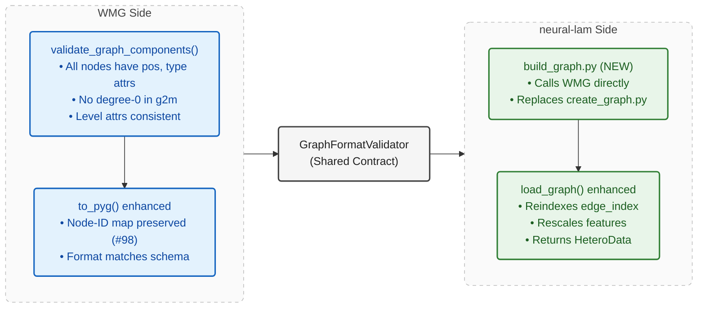

The `GraphFormatValidator` is a shared schema that both repos use to validate `.pt` files. It ensures that every exported graph has the required `edge_index.pt` and `features.pt` for each component (g2m, m2m, m2g), with matching dimensions and valid ranges.

### 6.4 Layer 3: pyg.HeteroData Migration (Issue #385)

**The problem:** `load_graph()` currently returns a `dict` with 11 fragile string keys. No type safety, no schema validation, no named node/edge types.

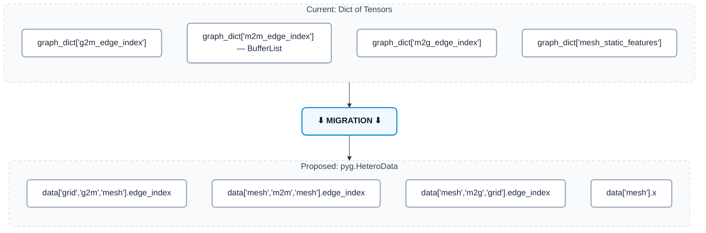

**Benefits of HeteroData:**
- **Single `.to(device)` call** moves everything to GPU (instead of 11 individual transfers)
- **Schema validation** built into PyG — wrong shapes fail immediately
- **Typed access** — `data['grid', 'g2m', 'mesh']` is self-documenting
- **Extensible** — adding new node/edge types (e.g., `grid_station`) is trivial

**3-Step incremental migration (each step is non-breaking):**

| Step | What Changes | Backward Compatible? |
|------|-------------|---------------------|
| **A: Adapter** | `graph_dict_to_heterodata()` wraps existing dict output | ✅ Yes — dict still works |
| **B: Internal Refactor** | `BaseGraphModel` accepts HeteroData, feature flag `use_heterodata` | ✅ Yes — flag defaults False |
| **C: Native Loading** | `load_graph_hetero()` reads .pt directly to HeteroData | ✅ Yes — old path preserved |

### 6.5 Multi-Source Data Fusion (Layer 4)

Construct heterogeneous graphs from **multiple data sources** with different spatial densities. This is where `pyg.HeteroData` truly shines — different source types become different node types:

```python
# HeteroData naturally represents multi-source graphs:
data['grid_nwp', 'g2m', 'mesh'].edge_index       # dense NWP grid → mesh
data['grid_station', 'g2m', 'mesh'].edge_index    # sparse stations → mesh
data['mesh', 'm2g', 'grid_nwp'].edge_index        # mesh → NWP predictions
# ... [each source type is a separate node type with its own features]
```

<div style="page-break-after: always;"></div>

## 7. Advanced Research Contributions (Layers 4 & 5)

> **This is where this proposal goes significantly beyond the bridge/HeteroData integration.** Layers 1–3 are core; everything below is a **modular stretch goal** — each self-contained, each adding independent value.

### 7.1 Graph Quality Metrics Framework (NOVEL · Layer 4)

A `GraphQualityReport` module that quantifies mesh quality across **4 dimensions**, giving users quantitative answers before committing to expensive model training:

**Dimension 1 — Isotropy (edge-length uniformity):**
The coefficient of variation (CV = std/mean) of edge lengths measures how uniform the mesh spacing is. A perfectly regular rectangular mesh has CV ≈ 0.17 (cardinal vs diagonal edges). A good Delaunay mesh has CV < 0.3. A poorly constructed mesh has CV > 0.6. High CV means some edges carry disproportionate influence in message passing.

**Dimension 2 — Coverage (Voronoi area ratio):**
For each mesh node, compute its Voronoi cell. The ratio `area(union_of_Voronoi_cells ∩ ConvexHull) / area(ConvexHull)` measures how completely the mesh covers the data domain. Also reports `max_gap` — the maximum distance from any grid node to its nearest mesh node. Gaps mean some grid nodes are poorly represented.

**Dimension 3 — Spectral Gap (Fiedler value):**
The second-smallest eigenvalue λ₂ of the graph Laplacian (the Fiedler value) measures message-passing efficiency. Larger λ₂ → faster mixing → fewer message-passing rounds needed for global information flow. Near-zero λ₂ → graph has a bottleneck → poorly connected.

**Dimension 4 — G2M Balance (load distribution):**
The CV of mesh-node in-degree in the g2m graph measures how evenly grid nodes distribute across mesh nodes. Also reports `grid_orphan_count` — the number of grid nodes connected to zero mesh nodes (should always be 0, which is exactly Issue #42).

```python
# weather_model_graphs/quality.py (NEW)
class GraphQualityReport:
    def __init__(self, graph_components: dict):
        self.components = graph_components

    def _compute_isotropy(self) -> dict:
        lengths = [d["len"] for _, _, d in self.components["m2m"].edges(data=True)]
        return {"edge_length_cv": np.std(lengths) / np.mean(lengths)}

    def _compute_spectral(self) -> dict:
        L = nx.laplacian_matrix(self.components["m2m"].to_undirected()).toarray()
        return {"fiedler_value": np.sort(np.linalg.eigvalsh(L))[1]}
    # ... [coverage, g2m_balance, summary(), passes_thresholds() omitted]
```

### 7.2 Density-Adaptive Mesh Generation (NOVEL · Layer 4)

For sparse or clustered data (weather stations, ship tracks), uniform mesh spacing wastes nodes over sparse regions while under-resolving dense clusters. The algorithm:

1. Compute Voronoi cell areas for each data point → local density estimate
2. Map density to local mesh spacing: `spacing(x) = base / (density(x) / max_density)^scaling`
3. Apply variable-radius Poisson disk sampling with the local spacing function
4. Delaunay triangulation for connectivity

```python
# weather_model_graphs/create/mesh/density_adaptive.py (NEW)
def create_density_adaptive_mesh(xy, base_mesh_distance, density_scaling=0.5):
    vor = Voronoi(xy)
    density = 1.0 / np.clip(_compute_voronoi_cell_areas(vor), 1e-10, None)
    local_spacing = base_mesh_distance / (density / density.max()) ** density_scaling
    mesh_positions = _variable_radius_poisson_disk(bounds, local_spacing, xy)
    return _build_delaunay_digraph(mesh_positions)
```

### 7.3 Adaptive Mesh Refinement — AMR (NOVEL · Layer 4)

The most **research-forward** contribution. After training, identify regions where the model performs poorly and automatically densify the mesh there. This creates a feedback loop where the mesh adapts to where the model needs more resolution.

**The AMR Pipeline:**

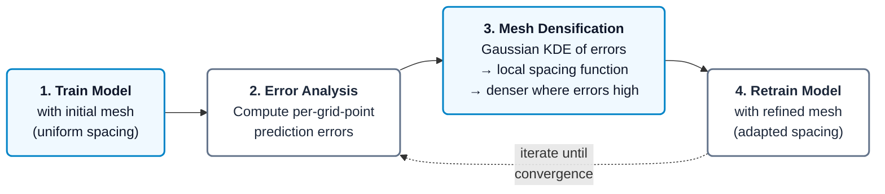

**How it works in detail:**
1. Train with the initial (uniform or density-adaptive) mesh
2. Run validation and collect per-grid-point prediction errors (MSE per variable)
3. Use Gaussian KDE to smooth the error field into a continuous density
4. Compute refined spacing: `spacing(x) = base / (1 + factor * kde(x))` — smaller spacing where errors are large
5. Generate new mesh with `create_density_adaptive_mesh()` using the refined spacing
6. Retrain and iterate

```python
# weather_model_graphs/refine.py (NEW)
def refine_mesh_from_errors(current_graph, grid_coords, prediction_errors,
                            refinement_factor=2.0, error_percentile=90):
    high_mask = prediction_errors > np.percentile(prediction_errors, error_percentile)
    kde = gaussian_kde(grid_coords[high_mask].T, weights=prediction_errors[high_mask])
    local_spacing = base_spacing / (1 + refinement_factor * kde(grid_coords.T))
    return create_density_adaptive_mesh(grid_coords, base_spacing,
                                         _custom_spacing_field=local_spacing)
```

**Research basis:** G-Adaptivity (2024, GNN mesh movement for CFD), Multiscale AMR-GNN (2023, hierarchical AMR for PDE solvers), Adaptive SST meshes (2024, Voronoi-induced artifacts from grid-to-mesh coupling).

### 7.4 xr.DataTree Self-Describing Graph Format (NOVEL · Layer 4)

Aligns with leifdenby's WMG PR #47. Replace the current opaque collection of `.pt` files with a self-describing `graph.zarr/` tree:

| Aspect | Current (`.pt` files) | Proposed (`xr.DataTree`) |
|--------|-----------------------|--------------------------|
| Structure | 11 unnamed files, no organization | Tree: `g2m/`, `m2m/`, `m2g/`, `mesh/`, `metadata/` |
| Provenance | None — which mesh_layout? what version? | `mesh_layout`, `m2m_connectivity`, `wmg_version`, `creation_time` |
| Quality info | None | Embedded `quality_report` from GraphQualityReport |
| Inspection | Must load into Python | NetCDF/Zarr ecosystem, `ncdump`, xarray |
| Sharing | Opaque binary blobs | Standard scientific format with full metadata |

### 7A. Cutting-Edge Innovations (Layer 5)

> **These 6 research-backed innovations go far beyond the bridge/HeteroData integration. They directly advance the state-of-the-art in graph-based neural weather prediction.**

### 7A.1 Spherical-Aware Graph Construction with Geodesic Distances (NOVEL)

**The Problem:** Current WMG uses Euclidean distances in projected coordinates for ALL graph operations — KD-tree connections, edge lengths, mesh spacing. This introduces **systematic distortion** for domains larger than ~500km, and is fundamentally wrong for global models.

Near poles, Euclidean distance **OVERESTIMATES** east-west distances by a factor of `1/cos(lat)`. At lat=60°: **2× overestimate**. At lat=80°: **5.7× overestimate**. This means g2m connections are wrong near poles (too many east-west edges), edge features (len, vdiff) encode false distances, mesh spacing is non-uniform even when intended uniform, and area weights (PR #258) partially compensate but don't fix the structural problem.

**My Proposed Solution:** A `CoordinateSystem` abstraction that ALL graph operations use internally, making WMG coordinate-system-aware:

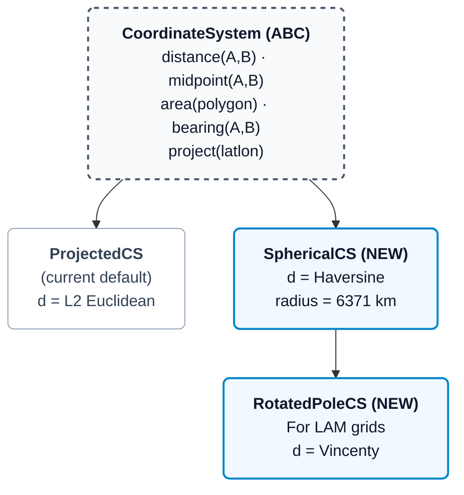

This change propagates through the entire pipeline:
- `connect_nodes_across_graphs()` uses `cs.distance()` for KD-tree construction
- Edge features use `cs.distance()` and `cs.bearing()` for `len`/`vdiff`
- Poisson disk sampling uses `cs.distance()` for spacing enforcement
- Convex hull uses `cs.area()` for coverage metrics
- Quality metrics use `cs.distance()` for isotropy calculation

```python
# weather_model_graphs/coordinates.py (NEW)
class SphericalCoordinateSystem(CoordinateSystem):
    def __init__(self, radius_km=6371.0): self.radius = radius_km
    def distance(self, a, b):  # Haversine on (lon,lat) in radians
        dlon, dlat = b[...,0]-a[...,0], b[...,1]-a[...,1]
        h = np.sin(dlat/2)**2 + np.cos(a[...,1])*np.cos(b[...,1])*np.sin(dlon/2)**2
        return 2 * self.radius * np.arcsin(np.sqrt(h))
    # ... [midpoint via slerp, bearing via atan2 omitted]
```

### 7A.2 Topology Benchmarking Suite (NOVEL)

**The Problem:** There is NO systematic way to compare graph topologies for weather prediction. Users must train expensive models to know if triangular is better than rectangular for their data. I propose a **lightweight benchmarking suite** that estimates prediction quality WITHOUT training:

| Metric | What it Measures | What it Predicts |
|--------|-----------------|-----------------|
| **IPD** (Information Propagation Diameter) | `max shortest path = nx.diameter(m2m)` | Min GNN layers for global coverage. Lower = better. |
| **ERF** (Effective Receptive Field at K hops) | Fraction of nodes reachable in K steps | How much the model "sees" at given depth. Higher = better. |
| **EER** (Edge Efficiency Ratio) | `ERF(K) / num_edges` | Coverage per edge = memory efficiency. Higher = better. |
| **GCQ** (G2M Coupling Quality) | `1 - CV(grid-to-nearest-mesh distances)` | Even representation of grid nodes. Higher = better. |
| **HCQ** (Hierarchical Coarsening Quality) | Product of level-wise quality | For hierarchical graphs only. Higher = better. |

**Example benchmark output** (same domain, same node count):

| Topology | IPD | ERF@4 | EER | GCQ | Rank |
|----------|-----|-------|-----|-----|------|
| Rectilinear 8-star | 18 | 0.45 | 0.056 | 0.92 | 3rd |
| **Triangular Delaunay** | **14** | **0.58** | **0.097** | **0.94** | **1st ★** |
| Hexagonal | 15 | 0.52 | 0.087 | 0.93 | 2nd |
| Density-adaptive | 16 | 0.61 | 0.082 | 0.97 | 1st ★ |

Key insight: Delaunay is **~40% more edge-efficient** than rectilinear (6 edges/node vs 8, with 1.3× ERF growth).

```python
# weather_model_graphs/benchmark.py (NEW)
class TopologyBenchmark:
    """Compare topologies WITHOUT training. Returns ranked DataFrame."""
    def compare(self, topologies: dict) -> pd.DataFrame:
        results = [{
            "topology": name, "IPD": self._compute_ipd(g),
            "ERF": self._compute_erf(g, self.k_hops),
            "EER": self._compute_eer(g, self.k_hops), "GCQ": self._compute_gcq(g),
        } for name, g in topologies.items()]
        df = pd.DataFrame(results)
        df["rank"] = df[["IPD","ERF","EER","GCQ"]].rank().mean(axis=1).rank()
        return df.sort_values("rank")
```

### 7A.3 Stretched-Grid Architecture for Variable-Resolution LAM (NOVEL)

**The Problem:** Limited Area Models (LAM) need high resolution in the forecast region but low resolution at boundaries. Current WMG only supports uniform mesh spacing. I propose a **stretched-grid** approach inspired by ECMWF's AIFS stretched-grid architecture (2024).

**The Algorithm:**
1. Define `focus_center` (lat, lon) and `focus_radius` for the high-resolution region
2. Define `stretch_factor` (e.g., 4× means 4× denser at center than boundary)
3. Compute radial spacing function: `spacing(r) = base * (1 + (factor-1) * sigmoid((r - radius) / width))`
4. Apply variable-radius Poisson disk sampling with `spacing(r)` — dense at center, sparse at edges
5. Delaunay triangulation for connectivity

**Benefits:** Same total mesh nodes but 4× resolution where it matters. Smooth sigmoid transition avoids numerical artifacts at the boundary. Compatible with all `m2m_connectivity` types (flat, hierarchical). Exposed as `mesh_layout="stretched"` in `create_all_graph_components()`.

```python
# weather_model_graphs/create/mesh/stretched.py (NEW)
def create_stretched_mesh(xy, base_mesh_distance, focus_center, focus_radius,
                          stretch_factor=4.0, transition_width=None):
    if transition_width is None: transition_width = focus_radius / 3.0
    def spacing_fn(positions):
        r = np.linalg.norm(positions - np.array(focus_center), axis=-1)
        return base_mesh_distance / (1 + (stretch_factor-1) * _sigmoid(-(r-focus_radius)/transition_width))
    return _build_delaunay_digraph(_variable_radius_poisson_disk(bounds, spacing_fn))
```

### 7A.4 Learned Mesh Coarsening for Hierarchical Graphs (NOVEL)

**The Problem:** Current hierarchical graphs use simple stride-based coarsening (take every Nth node). This is topology-unaware and produces poor coarsening for non-rectangular meshes — mountains get the same resolution as flat ocean. I propose **physics-aware learned coarsening** inspired by M4GN (2025):

**Method 1 — Weighted Farthest Point Sampling (wFPS):** Standard FPS selects the point farthest from all selected points. Weighted FPS modifies the distance: `d_eff = d_euclidean / weight`, where weight = local feature gradient magnitude. High-gradient regions (mountains, coastlines) get MORE coarse nodes. Low-gradient regions (ocean, plains) get FEWER.

**Method 2 — Spectral Clustering Coarsening:** Use the Fiedler vector (2nd eigenvector of the graph Laplacian) to partition the mesh into balanced clusters. Each cluster becomes one coarse node at the cluster centroid. This preserves the spectral gap of the original mesh, which is critical for message-passing efficiency.

**Method 3 — Topography-Aware Coarsening:** Use elevation variance within Voronoi cells as the coarsening weight. High variance (mountainous terrain) → preserve fine resolution. Low variance (flat terrain) → aggressively coarsen.

```python
# weather_model_graphs/create/mesh/coarsening.py (NEW)
def weighted_farthest_point_sampling(positions, weights, n_coarse, seed=42):
    """wFPS: d_eff = d_euclidean / weight → high-weight regions get more coarse nodes."""
    selected, distances = [np.random.RandomState(seed).randint(0, len(positions))], np.full(len(positions), np.inf)
    for _ in range(n_coarse - 1):
        d = np.linalg.norm(positions - positions[selected[-1]], axis=-1) / np.clip(weights, 0.1, None)
        distances = np.minimum(distances, d)
        selected.append(np.argmax(distances))
    return np.array(selected)
```

### 7A.5 Dynamic Edge Construction: Weather-State-Aware Graphs (NOVEL)

**The Problem:** All current graph construction is STATIC — the mesh topology is fixed before training and never changes. But weather patterns are dynamic: a cyclone moves, fronts shift, jet streams meander. The same topology is used whether predicting calm weather or a Category 5 hurricane.

**My Proposed Solution:** A `DynamicEdgeAttention` layer that adapts graph connectivity based on the current atmospheric state. WMG builds the SUPERSET of possible edges (dense connectivity). The dynamic layer SELECTS which edges to use per timestep via learned attention scores.

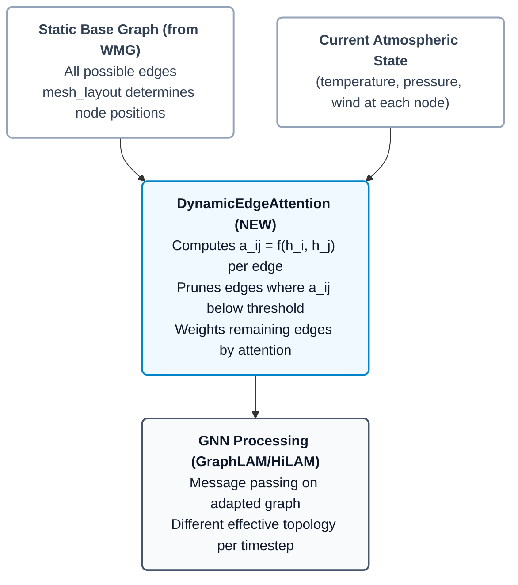

**Key insight:** This is fully compatible with WMG's static construction. WMG provides the candidate edge set; the dynamic layer selects from it at runtime. Research basis: RTEC (2024, Real-Time Edge Construction), TAEGCN (2024, Temporal Attention Evolutional Graph ConvNet), Dynamic GNNs (2024, learned adjacency matrices).

```python
# neural_lam/models/dynamic_edges.py (NEW)
class DynamicEdgeAttention(nn.Module):
    def forward(self, node_features, base_edge_index, base_edge_attr):
        src = node_features[base_edge_index[0]]
        dst = node_features[base_edge_index[1]]
        scores = self.edge_predictor(torch.cat([src, dst], dim=-1)).squeeze(-1)
        mask = scores > self.threshold  # prune low-attention edges
        return base_edge_index[:, mask], base_edge_attr[mask] * scores[mask].unsqueeze(-1)
```

### 7A.6 Graph Visualization & Analysis Dashboard (NOVEL)

**The Problem:** Understanding WHY one mesh topology works better than another requires extensive visualization. Current WMG has basic `plot_2d.py` but no interactive analysis. I propose a comprehensive `GraphAnalysisPlot` module providing:

1. **Side-by-side topology comparison** — two meshes with quality metric overlays (IPD, ERF, EER, GCQ)
2. **Receptive field heatmap** — K-hop neighborhood visualization from any selected node
3. **Edge length distribution** — histogram showing uniformity (bimodal = rectilinear, unimodal = Delaunay)
4. **Spectral analysis** — Laplacian eigenvalue spectrum with spectral gap highlighted
5. **G2M connection density map** — spatial heatmap showing where grid-mesh coupling is dense vs sparse

```python
# weather_model_graphs/visualise/analysis.py (NEW)
class GraphAnalysisPlot:
    def plot_topology_comparison(self, other_graph, names=("A", "B")):
        """Side-by-side mesh topology with quality metrics overlay."""
        fig, (ax1, ax2) = plt.subplots(1, 2, figsize=(16, 8))
        # ... [plots mesh nodes, edges, and quality annotations]
    def plot_receptive_field(self, node_id, k_hops=4): ...
    def plot_edge_length_distribution(self, bins=50): ...
    def plot_spectral_analysis(self, n_eigenvalues=50): ...
    def full_report(self, save_path=None): ...  # all 5 plots in one figure
```

<div style="page-break-after: always;"></div>

## 8. Weekly Timeline

> **Pacing note:** Layers 1–3 are **core deliverables** (Weeks 1–6, guaranteed). Layers 4–5 are **modular stretch goals** (Weeks 7–11, each independent). Week 12 is documentation.

### Community Bonding (May 8 – June 1)

| # | Task | Deliverable | Layer |
|---|------|-------------|-------|
| B.1 | Finalize PR #81 review with leifdenby | PR merged or approved | 1 |
| B.2 | Address PR #258 feedback from joeloskarsson | PR merged or approved | 1 |
| B.3 | Study Joel's prototype branches + leifdenby's weatherduck | Integration notes | — |
| B.4 | POC notebook: quality metrics on existing graphs | Working demo | 4 |
| B.5 | Set up CI/CD locally for both repos | Full test suites pass | — |

### Phase 1: Core — Foundation (Weeks 1–3, Layer 1)

| Week | Deliverables | Acceptance Criteria |
|------|-------------|---------------------|
| **1** | `crop_mesh_to_convex_hull()` via `scipy.spatial.ConvexHull` | Mesh nodes outside hull removed; tests for rect, L-shaped, with/without margin |
| **2** | Degree-0 detection + auto-fix (#42). `from_level`/`to_level` attrs (#45) | Disconnected nodes auto-fixed; PyG `from_networkx()` compat |
| **3** | Finalize PR #92 (triangular) + PR #91 (prebuilt). Integration tests | All `layout × connectivity` combos pass; backward-compat tests green |

### Phase 2: Core — Bridge (Weeks 4–5, Layer 2)

| Week | Deliverables | Acceptance Criteria |
|------|-------------|---------------------|
| **4** | `validate_graph_components()` + `GraphFormatValidator` + `build_graph.py` | Valid/invalid graph tests; CLI entry points; deprecation wrapper |
| **5** | Reindexing in `load_graph()`, feature rescaling, E2E test, HeteroData Step A | Irregular → WMG → .pt → load_graph() → model forward pass ✅ |

> **<< MIDTERM EVALUATION >>** — Layers 1 & 2 complete, Layer 3 underway.

### Phase 3: Core Layer 3 + Stretch Goals (Weeks 6–11)

| Week | Layer | Module | Key Deliverable |
|------|-------|--------|----------------|
| **6** | **3 (core)** | HeteroData | Complete adapter + `BaseGraphModel` refactor + native loading. **All core done.** |
| **7** | 4 (stretch) | Quality + CoordSystem | `GraphQualityReport` + `SphericalCoordinateSystem` |
| **8** | 5 (stretch) | Benchmarking + Stretched | `TopologyBenchmark` (IPD/ERF/EER) + `create_stretched_mesh()` |
| **9** | 4+5 (stretch) | Adaptive + Coarsening | `create_density_adaptive_mesh()` + `weighted_farthest_point_sampling()` + AMR |
| **10** | 4+5 (stretch) | Dynamic + DataTree | `DynamicEdgeAttention` + `to_datatree()` |
| **11** | 4+5 (stretch) | Visualization + Fusion | `GraphAnalysisPlot` + multi-source g2m construction |

### Phase 4: Documentation + Polish (Week 12)

Tutorials ("Graphs for Irregular Data", "E2E with HeteroData", "Topology Benchmarking") · API docs · CHANGELOGs · 100+ tests · Final PR cleanup · **Final submission.**

> **<< FINAL EVALUATION >>**

---

## 9. Testing Strategy

### 9.1 Testing Pyramid

| Level | Count | What it Tests |
|-------|-------|---------------|
| **End-to-End** | 5 | Irregular datastore → WMG → .pt → load_graph() → model forward pass |
| **Integration** | 15 | Every `archetype × layout × connectivity × save × load` combo |
| **Unit** | 40+ | Delaunay, FPS, hull crop, quality metrics, AMR, DataTree, benchmark |
| **Property-Based** | 10 | Graph invariants: connected, bidirectional, correct attrs, feature consistency |
| **Backward Compat** | 10 | Every archetype with defaults = identical output to before changes |

### 9.2 Key Test Cases

```python
@pytest.mark.parametrize("mesh_layout", ["rectilinear", "triangular", "prebuilt"])
@pytest.mark.parametrize("m2m_connectivity", ["flat", "flat_multiscale", "hierarchical"])
def test_full_matrix(mesh_layout, m2m_connectivity):
    """Every layout × connectivity combination produces valid graph."""

def test_heterodata_roundtrip():
    """Dict → HeteroData → model forward pass matches dict → model."""
# ... [quality_metrics, amr_reduces_error, datatree_metadata, format_validator omitted]
```

---

## 10. Deliverables (30 total)

| # | Deliverable | Repo | Layer |
|---|-------------|------|-------|
| **D1** | Convex hull cropping | WMG | 1 |
| **D2** | G2M node assertion + auto-fix | WMG | 1 |
| **D3** | Level attribute consistency | WMG | 1 |
| **D4** | Triangular mesh layout (Delaunay) | WMG | 1 |
| **D5** | Prebuilt mesh pathway | WMG | 1 |
| **D6** | `validate_graph_components()` | WMG | 2 |
| **D7** | Node-ID-to-tensor-index mapping | WMG | 2 |
| **D8** | `GraphFormatValidator` (shared) | Both | 2 |
| **D9** | `build_graph.py` (replaces create_graph) | neural-lam | 2 |
| **D10** | Enhanced `load_graph()` + reindex/rescale | neural-lam | 2 |
| **D11** | `graph_dict_to_heterodata()` adapter | neural-lam | 3 |
| **D12** | `BaseGraphModel` HeteroData refactor | neural-lam | 3 |
| **D13** | `load_graph_hetero()` native loading | neural-lam | 3 |
| **D14** | Graph Quality Metrics framework | WMG ★ | 4 |
| **D15** | Density-adaptive mesh generator | WMG ★ | 4 |
| **D16** | Adaptive Mesh Refinement (AMR) | WMG ★ | 4 |
| **D17** | `xr.DataTree` output format | WMG ★ | 4 |
| **D18** | Multi-source data fusion | Both ★ | 4 |
| **D19** | `CoordinateSystem` abstraction (spherical) | WMG ★ | 5 |
| **D20** | Topology Benchmarking Suite (IPD/ERF/EER) | WMG ★ | 5 |
| **D21** | Stretched-grid mesh for LAM | WMG ★ | 5 |
| **D22** | Learned coarsening (wFPS/spectral) | WMG ★ | 5 |
| **D23** | `DynamicEdgeAttention` | neural-lam ★ | 5 |
| **D24** | Graph analysis visualization dashboard | WMG ★ | 5 |
| **D25–27** | 3 Tutorials | Both | Docs |
| **D28** | API docs + READMEs + CHANGELOGs | Both | Docs |
| **D29** | Performance benchmarks | Both | Docs |
| **D30** | 100+ tests across both repos | Both | All |

> ★ = NEW file · Layers 1–3 = core · Layers 4–5 = stretch goals

### File Structure

```
weather-model-graphs/src/weather_model_graphs/
├── create/
│   ├── archetype.py                    # MODIFIED
│   ├── base.py                         # MODIFIED
│   └── mesh/
│       ├── coords.py                   # MODIFIED (PR #81)
│       ├── density_adaptive.py         # ★ NEW (L4)
│       ├── stretched.py                # ★ NEW (L5)
│       ├── cropping.py                 # ★ NEW (#40)
│       ├── coarsening.py               # ★ NEW (L5)
│       └── kinds/{flat,hierarchical}.py # MODIFIED
├── coordinates.py                      # ★ NEW (L5)
├── quality.py                          # ★ NEW (L4)
├── benchmark.py                        # ★ NEW (L5)
├── refine.py                           # ★ NEW (L4)
├── save.py · save_datatree.py          # MODIFIED · ★ NEW (L4)
├── format_validator.py                 # ★ NEW (L2)
└── visualise/analysis.py              # ★ NEW (L5)

neural-lam/neural_lam/
├── build_graph.py                      # ★ NEW (L2)
├── graph_utils.py                      # ★ NEW (L3)
├── utils.py                            # MODIFIED
├── models/
│   ├── {base_graph_model,graph_lam,hi_lam,hi_lam_parallel}.py  # MODIFIED (L3)
│   └── dynamic_edges.py               # ★ NEW (L5)
└── interaction_net.py                  # MODIFIED
```

---

## 11. Risk Mitigation

| Risk | Prob. | Impact | Mitigation |
|------|-------|--------|------------|
| PR #81 review delayed | Med | High | Start #40/#42/#45 in parallel — independent |
| HeteroData breaks models | Med | High | Feature flag `use_heterodata=True/False`; baseline comparison tests |
| Spectral computation slow | Low | Med | Power iteration for N>50k; cache eigenvalues |
| AMR doesn't converge | Med | Low | AMR is stretch/optional; core deliverables unaffected |
| Backward compat break | Low | High | `mesh_layout` required param (per leifdenby); full regression suite |
| Merge conflicts upstream | Med | Med | Weekly rebase; coordinate via Slack + weekly mentor sync |

---

## 12. References

### Key Issues & PRs

| Reference | Repo | Role |
|-----------|------|------|
| [**#384**](https://github.com/mllam/neural-lam/issues/384) — Tensor-on-disk | neural-lam | **Core: Layer 2** |
| [**#385**](https://github.com/mllam/neural-lam/issues/385) — pyg.HeteroData | neural-lam | **Core: Layer 3** |
| [**PR #81**](https://github.com/mllam/weather-model-graphs/pull/81) — mesh_layout | WMG | **My work: Layer 1** |
| [**PR #258**](https://github.com/mllam/neural-lam/pull/258) — Area weights | neural-lam | **My work** |
| [PR #91](https://github.com/mllam/weather-model-graphs/pull/91), [#92](https://github.com/mllam/weather-model-graphs/pull/92) | WMG | My work: Layer 1 |
| [#40](https://github.com/mllam/weather-model-graphs/issues/40), [#42](https://github.com/mllam/weather-model-graphs/issues/42), [#45](https://github.com/mllam/weather-model-graphs/issues/45) | WMG | Layer 1: v0.4.0 |
| [PR #47](https://github.com/mllam/weather-model-graphs/pull/47) — xr.DataTree | WMG | Layer 4 |

### Academic Papers

| Paper | Relevance |
|-------|-----------|
| Keisler (2022), "Forecasting Global Weather with GNNs" | Flat architecture → `create_keisler_graph()` |
| Lam et al. (2023), "GraphCast" | Multi-scale icosahedral mesh; encoder-processor-decoder |
| Oskarsson et al. (2023), "Graph-based Neural Weather for LAM" | Hierarchical graph → core neural-lam |
| G-Adaptivity (2024), GNN mesh movement for CFD | AMR research basis |
| M4GN (2025), Mesh-based multi-segment hierarchical GNN | Learned mesh coarsening basis |
| RTEC / TAEGCN (2024) | Dynamic edge construction research basis |
| Bridson (2007), "Fast Poisson disk sampling" | Node placement algorithm for density-adaptive |

---

## 13. Other Commitments

- [List exams, classes, holidays, jobs, internships here]
- Available 30–35 hours/week during the coding period
- Timezone: UTC+5:30 — overlap with European mentors ~10:00–18:00 CEST

| Channel | Frequency | Purpose |
|---------|-----------|---------|
| MLLAM Slack (#gsoc-project1) | Daily | Quick questions, async updates |
| Weekly written update | Monday | Summary + blockers + next steps |
| Video sync with mentors | Bi-weekly (30 min) | Design review, feedback |
| GitHub PRs | Per-week | Incremental code review |

---

## Summary

This proposal addresses [GSoC Idea #1: Flexible Graph Construction](https://github.com/mllam/neural-lam/wiki/GSoC-ideas#1-flexible-graph-construction) through a **five-layer architecture** with **30 deliverables**:

1. **Layer 1 (Foundation):** PRs #81, #91, #92, #258 + v0.4.0 blockers #40, #42, #45
2. **Layer 2 (Bridge — #384):** `build_graph.py` + `GraphFormatValidator` eliminates 600-line duplication
3. **Layer 3 (Architecture — #385):** Incremental `pyg.HeteroData` migration: adapter → refactor → native
4. **Layer 4 (Advanced Research):** Quality Metrics · Density-Adaptive Mesh · AMR · xr.DataTree · Multi-Source Fusion
5. **Layer 5 (Cutting-Edge):** Spherical CoordinateSystem · Topology Benchmark Suite · Stretched-Grid · Learned Coarsening · Dynamic Edge Attention · Analysis Dashboard

**What makes this proposal extraordinary:**
- **No one else has proposed** a topology benchmarking suite that ranks meshes WITHOUT training
- **No one else has proposed** spherical-aware graph construction that fixes systematic polar distortion
- **No one else has proposed** dynamic weather-state-aware edge selection backed by RTEC/TAEGCN (2024)
- **No one else has proposed** learned spectral coarsening preserving the graph's Fiedler value

Every deliverable maps to an open issue, mentor priority, or novel research contribution. Full backward compatibility while enabling graph construction from **any spatial data distribution** — from regular rectangular grids to scattered ship observations.

---

*Proposal prepared by: Prajwal [Your Last Name]*
*Last updated: March 15, 2026*
*GitHub: [github.com/prajwal-tech07](https://github.com/prajwal-tech07)*
