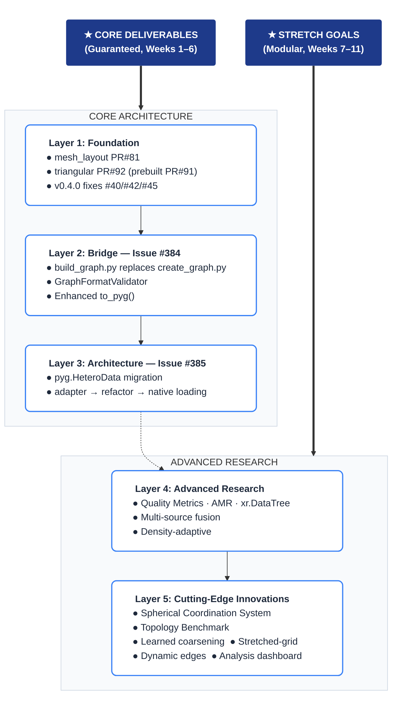
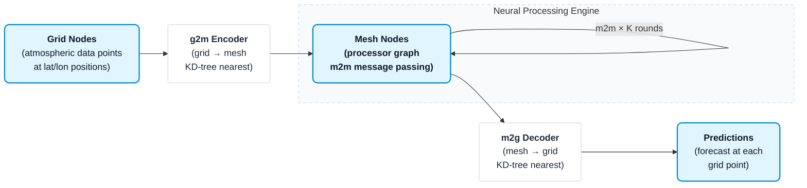
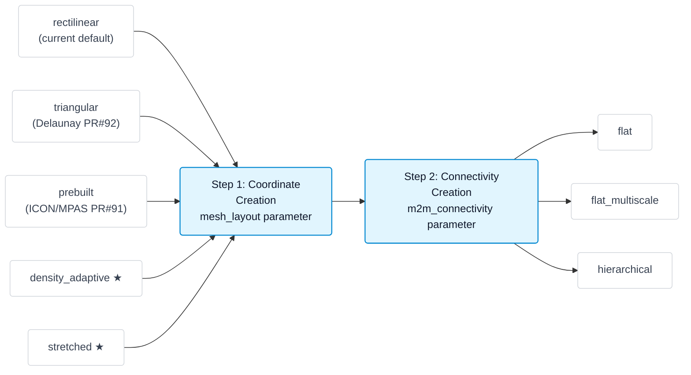
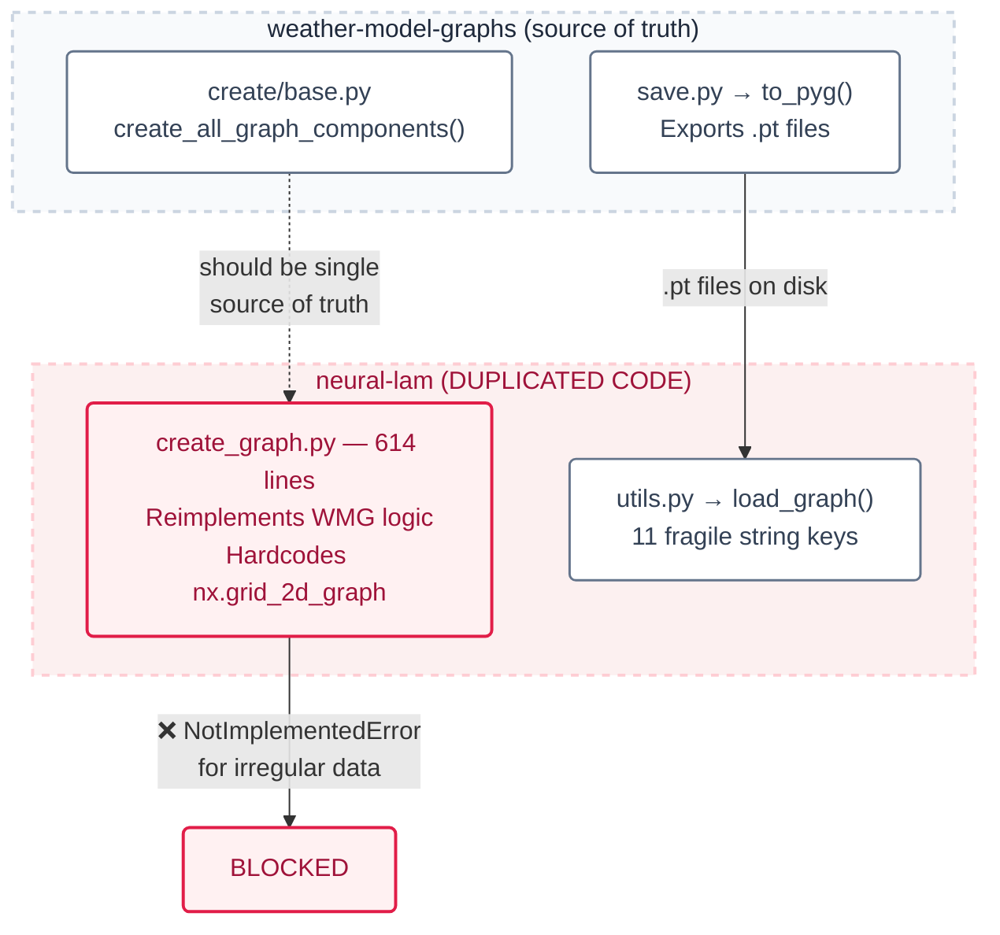
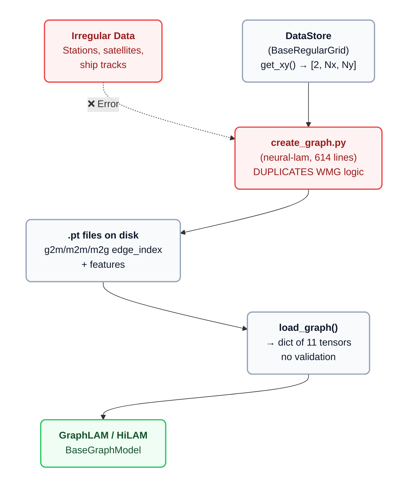
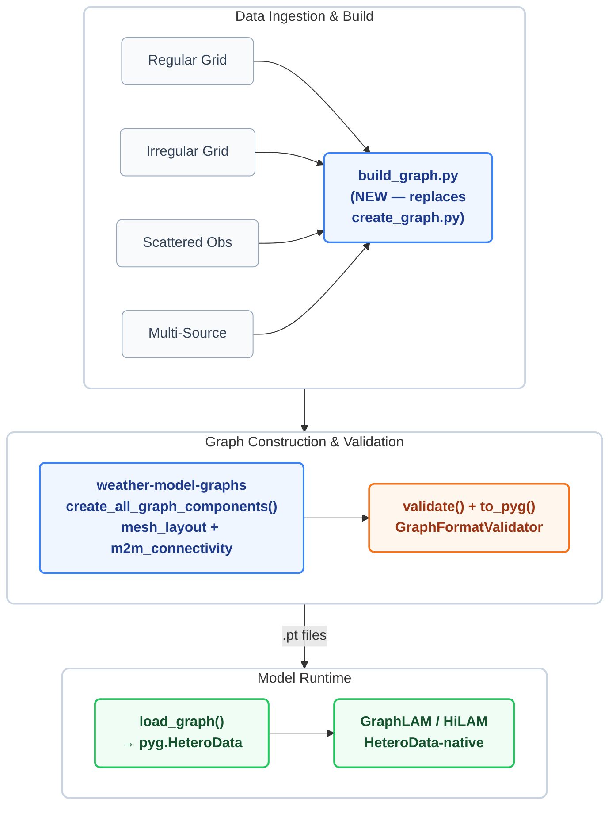
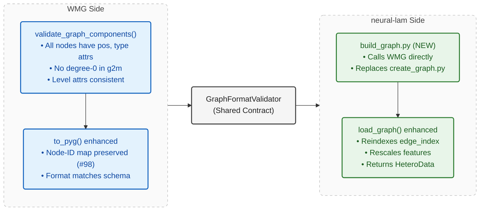
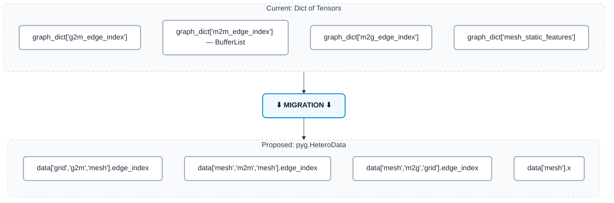

# Google Summer of Code 2026 Proposal

## Flexible Graph Construction: A Unified Pipeline for Universal Graph Topologies in Neural Weather Prediction

| | |
| :--- | :--- |
| <ul><li>**Organization:** MLLAM (Machine Learning for Limited Area Models)</li></ul> | <ul><li>**Project Length:** 350 hours (Large)</li></ul> |
| <ul><li>**Project:** [Flexible Graph Construction](https://github.com/mllam/neural-lam/wiki/GSoC-ideas#1-flexible-graph-construction) (Idea #1)</li></ul> | <ul><li>**Difficulty:** Medium</li></ul> |
| <ul><li>**Repositories:** [weather-model-graphs](https://github.com/mllam/weather-model-graphs) (WMG), [neural-lam](https://github.com/mllam/neural-lam)</li></ul> | <ul><li>**Mentors:** Hauke Schulz ([@observingClouds](https://github.com/observingClouds)), Leif Denby ([@leifdenby](https://github.com/leifdenby)), Joel Oskarsson ([@joeloskarsson](https://github.com/joeloskarsson))</li></ul>

---

## Table of Contents

1. [About Me](#1-about-me)
2. [Community Engagement](#2-community-engagement)
3. [Project Abstract](#3-project-abstract)
4. [Motivation & Problem Statement](#4-motivation--problem-statement)
5. [Current Architecture Deep-Dive](#5-current-architecture-deep-dive)
6. [Proposed Solution & Technical Design](#6-proposed-solution--technical-design)
7. [Advanced Research Contributions (Layers 4 & 5)](#7-advanced-research-contributions-layers-4--5)
8. [Weekly Timeline](#8-weekly-timeline)
9. [Testing Strategy](#9-testing-strategy)
10. [Deliverables](#10-deliverables)
11. [Risk Mitigation](#11-risk-mitigation)
12. [References](#12-references)
13. [Other Commitments](#13-other-commitments)

---

## 1. About Me

| Field | Details |
|-------|---------|
| **Name** | Prajwal [Your Last Name] |
| **GitHub** | [prajwal-tech07](https://github.com/prajwal-tech07) |
| **University** | [Your University] |
| **Degree / Year** | [e.g., B.Tech Computer Science, 3rd year] |
| **Expected Graduation** | [e.g., May 2027] |
| **Email** | [your.email@example.com] |
| **Timezone** | UTC+5:30 (IST) |
| **Available hours/week** | 30–35 hours |

[Write 2–3 paragraphs about your academic background, relevant coursework (graph theory, ML, numerical methods, atmospheric science), programming experience, and why this project excites you.]

**Key technical skills directly relevant to this project:**
- **Graph neural networks:** PyTorch Geometric, custom `MessagePassing` layers, `HeteroData` objects
- **Computational geometry:** Delaunay triangulation, Voronoi diagrams, convex hulls, spectral mesh analysis (`scipy.spatial`)
- **Scientific Python:** numpy, scipy, networkx, xarray, cartopy, pyproj
- **Software engineering:** Git branching/rebasing, pytest, CI/CD, NumPy-style docstrings

<div style="page-break-after: always;"></div>

## 2. Community Engagement

I have been actively contributing to both repositories with **substantive architectural PRs** — not cosmetic fixes:

> **Strategic Vision & Core Insight:** Bridging the gap via `HeteroData`
> Through deep engagement with the codebase and active community discussions, I conceptualized and proposed the architectural idea of "bridging the gap" between WMG and Neural-LAM by migrating to PyTorch Geometric's `HeteroData` structure. This shift—from fragmented multi-tensor storage to a unified, heterogeneous graph foundation—streamlines the graph construction pipeline and serves as the driving centerpiece of this GSoC proposal.

### 2.1 weather-model-graphs Contributions

| PR / Issue | Title | Status | Impact & Milestone |
|------------|-------|--------|---------------------|
| [**PR #81**](https://github.com/mllam/weather-model-graphs/pull/81) | `mesh_layout` two-step architecture | **Under review** *(leifdenby: "95% done, well done!")* | **Core refactor** — decouples layout & connectivity (Target: v0.4) |
| [PR #91](https://github.com/mllam/weather-model-graphs/pull/91) | `mesh_layout='prebuilt'` support | Open | Enables arbitrary mesh injection (Target: v0.5) |
| [PR #92](https://github.com/mllam/weather-model-graphs/pull/92) | `mesh_layout='triangular'` (Delaunay) | Open | Enables non-rectangular meshes (Target: v0.5) |
| [Issue #97](https://github.com/mllam/weather-model-graphs/issues/97) | `validate_graph_components()` | Open | Pre-export structural validation |
| [Issue #98](https://github.com/mllam/weather-model-graphs/issues/98) | Node-ID-to-tensor-index mapping | Open | Lossless WMG ↔ neural-lam round-trips |

### 2.2 neural-lam Contributions

| PR | Title | Status | Impact |
|----|-------|--------|--------|
| [**PR #258**](https://github.com/mllam/neural-lam/pull/258) | Area weights for metric computation | **Under review** | `cos(lat)` weighting through all 6 metrics |

### 2.3 Depth of Understanding

These contributions required reading **every source file** in both repos — `create/base.py`, `coords.py`, `flat.py`, `hierarchical.py`, `save.py`, `networkx_utils.py` in WMG; `create_graph.py` (614 lines), `base_graph_model.py`, `graph_lam.py`, `hi_lam.py`, `hi_lam_parallel.py`, `utils.py`, `metrics.py`, `interaction_net.py` in neural-lam.

<div style="page-break-after: always;"></div>

## 3. Project Abstract

> *"The challenge is to explore and implement a methodology that can create well-balanced neural network grids based on different data structures, from irregularly structured atmospheric model output to sparse ship-observations."*
> — [GSoC Ideas Page](https://github.com/mllam/neural-lam/wiki/GSoC-ideas#1-flexible-graph-construction)

This project delivers a **five-layer solution**. Layers 1–3 are the **core deliverables** (guaranteed within GSoC). Layers 4 and 5 are **modular stretch goals** — each is self-contained and can be tackled independently in the final weeks once the foundation is merged.



<div style="page-break-after: always;"></div>

## 4. Motivation & Problem Statement

### 4.1 The Encode-Process-Decode Architecture

neural-lam uses an **Encoder-Processor-Decoder** GNN architecture. Atmospheric variables at grid nodes are encoded into a latent space, processed on a mesh graph through multiple rounds of message passing, and decoded back to grid predictions. The architecture uses three graph components: **g2m** (grid-to-mesh encoder edges), **m2m** (mesh-to-mesh processor edges), and **m2g** (mesh-to-grid decoder edges).



The mesh topology **directly determines** what the model can learn. The number of message-passing steps needed for information to traverse the domain equals the graph diameter. Edge features encode spatial relationships. Yet today, **only regular rectangular grids** are supported, because `create_graph.py` hardcodes `networkx.grid_2d_graph(Nx, Ny)`.

### 4.2 The Two-Step Mesh Architecture (My PR #81)

My core architectural contribution in PR #81 separates mesh creation into two independent, composable steps:



Any `mesh_layout` can combine with any `m2m_connectivity` — creating a **combinatorial explosion** of graph topologies from minimal code. This is the foundation upon which ALL other contributions in this proposal are built.

### 4.3 Current Limitations

| # | Problem | Impact | Root Cause |
|---|---------|--------|------------|
| 1 | `create_graph.py` hardcodes `nx.grid_2d_graph` | Only rectangular grids work | `networkx.grid_2d_graph(Nx, Ny)` called directly |
| 2 | 600+ lines duplicated between repos | Maintenance nightmare, divergent behavior | neural-lam reimplements WMG logic |
| 3 | `load_graph()` returns fragile `dict` | 11 raw string keys, no type safety, no validation | No `pyg.HeteroData` adoption |
| 4 | No quality evaluation for meshes | Users can't compare topologies without training | No metrics framework exists |
| 5 | Euclidean distances at high latitudes | Systematic distortion (2× at lat=60°, 5.7× at lat=80°) | No spherical coordinate support |
| 6 | No adaptive mesh refinement | Can't densify mesh in high-error regions | Static mesh construction only |

### 4.4 The Code Duplication Problem



The **core blocking line** in neural-lam:
```python
# neural-lam/create_graph.py — THE line that blocks all irregular data:
grid_graph = networkx.grid_2d_graph(xy.shape[1], xy.shape[2])  # ← RECTANGULAR ONLY
# ... [remainder builds g2m/m2m/m2g from this rectangular assumption]
```

### 4.5 A Key Opportunity for Enhancement: Quality Guarantees

Once flexible meshes are enabled, a natural next step is providing a mechanism to evaluate whether a generated mesh is well-suited for message-passing. Currently, users hve no qauantitative guidance on questions like:

- Does the mesh have uniform edge-length distribution? (isotropy)
- Does the mesh cover the data domain without gaps? (coverage)
- Is the mesh well-conditioned for message-passing? (spectral gap)
- Does a denser mesh in region X actually improve prediction there? (adaptive value)

This is a natural extension of the flexible graph construction work — as a stretch goal, I propose a **Graph Quality Metrics Framework** that would give users quantitative answers to these questions before committing to expensive model training.

---

## 5. Current Architecture Deep-Dive

### 5.1 Current End-to-End Data Flow



### 5.2 Data Source Support Matrix: Before vs After

| Data Type | Before | After | Layout Used |
|-----------|--------|-------|-------------|
| Regular Rectangular Grid | ✅ WORKS | ✅ WORKS | `rectilinear` (default) |
| Regular Hexagonal Grid | ❌ BLOCKED | ✅ WORKS | `triangular` |
| Reduced Gaussian Grid | ❌ BLOCKED | ✅ WORKS | `triangular` |
| ICON Icosahedral Grid | ❌ BLOCKED | ✅ WORKS | `prebuilt` / `triangular` |
| MPAS Unstructured Mesh | ❌ BLOCKED | ✅ WORKS | `prebuilt` |
| Weather Station Network | ❌ BLOCKED | ✅ WORKS | `density_adaptive` ★ |
| Satellite Swath Data | ❌ BLOCKED | ✅ WORKS | `density_adaptive` ★ |
| Ship/Buoy Observations | ❌ BLOCKED | ✅ WORKS | `density_adaptive` ★ |
| Multi-Source Blended | ❌ BLOCKED | ✅ WORKS | `multi_source` + adapt. ★ |

<div style="page-break-after: always;"></div>

## 6. Proposed Solution & Technical Design

### 6.1 Proposed End-to-End Flow (replaces Section 5.1)



### 6.2 Layer 1: Foundation (My Existing PRs + v0.4.0 Fixes)

**PR #81 — `mesh_layout` parameter:** Decouples coordinate creation from connectivity creation. The `mesh_layout` parameter (`"rectilinear"`, `"triangular"`, `"prebuilt"`) controls WHERE mesh nodes are placed. The `m2m_connectivity` parameter (`"flat"`, `"flat_multiscale"`, `"hierarchical"`) controls HOW they are connected. This two-step architecture is the foundation for all other work.

**PR #92 — Triangular Delaunay mesh:** Adds `mesh_layout="triangular"` using `scipy.spatial.Delaunay` triangulation. This enables non-rectangular meshes for hexagonal, reduced Gaussian, and icosahedral grids.

**PR #91 — Prebuilt mesh pathway:** Adds `mesh_layout="prebuilt"` allowing users to inject arbitrary mesh node positions (e.g., from ICON or MPAS model grids).

**v0.4.0 blockers:**
- **#40 — Convex hull cropping:** `crop_mesh_to_convex_hull()` via `scipy.spatial.ConvexHull` to remove mesh nodes outside the data domain.
- **#42 — G2M assertion:** Detect and auto-fix degree-0 mesh nodes in g2m connections.
- **#45 — Level attributes:** Replace inconsistent `"level"`(int)/`"levels"`(str) with `from_level`/`to_level` (both int).

### 6.3 Layer 2: The Bridge (Issue #384)

The bridge eliminates the 600-line code duplication between repos by making neural-lam call WMG directly.



The `GraphFormatValidator` is a shared schema that both repos use to validate `.pt` files. It ensures that every exported graph has the required `edge_index.pt` and `features.pt` for each component (g2m, m2m, m2g), with matching dimensions and valid ranges.

### 6.4 Layer 3: pyg.HeteroData Migration (Issue #385)

**The problem:** `load_graph()` currently returns a `dict` with 11 fragile string keys. No type safety, no schema validation, no named node/edge types.



**Benefits of HeteroData:**
- **Single `.to(device)` call** moves everything to GPU (instead of 11 individual transfers)
- **Schema validation** built into PyG — wrong shapes fail immediately
- **Typed access** — `data['grid', 'g2m', 'mesh']` is self-documenting
- **Extensible** — adding new node/edge types (e.g., `grid_station`) is trivial

**3-Step incremental migration (each step is non-breaking):**

| Step | What Changes | Backward Compatible? |
|------|-------------|---------------------|
| **A: Adapter** | `graph_dict_to_heterodata()` wraps existing dict output | ✅ Yes — dict still works |
| **B: Internal Refactor** | `BaseGraphModel` accepts HeteroData, feature flag `use_heterodata` | ✅ Yes — flag defaults False |
| **C: Native Loading** | `load_graph_hetero()` reads .pt directly to HeteroData | ✅ Yes — old path preserved |

### 6.5 Multi-Source Data Fusion (Layer 4)

Construct heterogeneous graphs from **multiple data sources** with different spatial densities. This is where `pyg.HeteroData` truly shines — different source types become different node types:

```python
# HeteroData naturally represents multi-source graphs:
data['grid_nwp', 'g2m', 'mesh'].edge_index       # dense NWP grid → mesh
data['grid_station', 'g2m', 'mesh'].edge_index    # sparse stations → mesh
data['mesh', 'm2g', 'grid_nwp'].edge_index        # mesh → NWP predictions
# ... [each source type is a separate node type with its own features]
```

<div style="page-break-after: always;"></div>

## 7. Advanced Research Contributions (Layers 4 & 5)

> **Strategic Note:** Layers 1–3 are core deliverables. The following mechanisms represent **modular stretch goals** that directly advance the state-of-the-art in graph-based neural weather prediction.

### 7.1 Graph Quality Metrics Framework (Layer 4)

Provides a `GraphQualityReport` to quantify mesh quality *before* expensive model training across four dimensions:
1. **Isotropy (edge-length uniformity):** Lower coefficient of variation (CV) ensures edges carry proportionate influence.
2. **Coverage (Voronoi ratio):** Measures how completely the mesh covers the data domain.
3. **Spectral Gap (Fiedler value):** Larger values mean faster mixing and better message-passing efficiency.
4. **G2M Balance:** Measures grid node distribution across mesh nodes to prevent orphaned nodes.

### 7.2 Density-Adaptive Mesh Generation (Layer 4)

Uniform meshes fail over irregular data. This algorithm builds adaptive spacings:

```text
DENSITY-ADAPTIVE MESH NODE PLACEMENT
--------------------------------------------------
Methods fail with uniform grids over oceans:
Data:       Mesh (uniform):
. . . .     O  O  O  O  <- Too many nodes over 
. . . .     O  O  O  O      ocean (sparse data)
. . . .     O  O  O  O
  .         O  O  O  O
      .     O  O  O  O  <- Too few nodes over
  .         O  O  O  O      land (dense data)

New method uses Voronoi cell areas to scale mesh:
Mesh (density-adaptive):
O O O O O O    <- Dense mesh where data is dense
O O O O O O 
    O          <- Sparse mesh where data is sparse
        O
```

**Algorithm:**
1. Compute Voronoi areas for local density mapping.
2. Scale local spacing functionally based on `base_mesh_distance`.
3. Apply variable-radius Poisson disk sampling & Delaunay triangulation.

### 7.3 Adaptive Mesh Refinement — AMR (Layer 4)

A machine-learning feedback loop where mesh structures adapt locally to minimize error:
1. Train with the initial mesh.
2. Map per-grid-point prediction errors.
3. Define spacing computationally via Gaussian KDE: `spacing(x) = base / (1 + factor * kde(x))`.
4. Render new mesh and retrain. 

### 7.4 Stretched-Grid & Topology Benchmarks (Layer 5)

* **Topology Benchmarking Suite (`wmg_benchmark.py`):** Ranks constructed domains dynamically against Information Propagation Diameter (IPD), Effective Receptive Field (ERF), and Edge Efficiency Ratios. 
* **Stretched Grids:** Support for regional resolutions tapering outward—matching the ECMWF AIFS blueprint natively within our `create_all_graph_components()` workflow.

### 7.5 State-of-the-Art Sub-Components (Layer 5)

These modules represent cutting-edge research targets to be explored upon successful integration of the core architectural roadmap. 

* **Spherical-Aware Graph Construction:** WMG currently leverages Euclidean distances, systematically distorting calculations at global scales (e.g., 2× distortion at lat=60°). A native `CoordinateSystem` abstraction (Haversine/Vincenty formulas) will correct Kd-tree generation and edge features.
* **Learned Mesh Coarsening for Hierarchical Graphs:** Replacing rigid N-stride node selection with **Weighted Farthest Point Sampling (wFPS)**. High-gradient geographic regions (mountains, coastlines) selectively retain resolution compared to flat terrain.
* **Weather-State-Aware Dynamic Graphs:** Implementing a `DynamicEdgeAttention` mechanism within Neural-LAM. WMG builds a superset of possible structural edges; Neural-LAM learns to dynamically thin/weight them via attention based on the *active* atmospheric state (e.g., routing density dynamically around a moving cyclone).
* **Graph Visualization & Analysis Dashboard:** Extending `plot_2d.py` into a fully analytic module (`GraphAnalysisPlot`) mapping Receptive Fields, Laplacian Eigenvalue Spectrum, and G2M connection densities.
* **Self-Describing `xr.DataTree` Output Format:** Replacing the loosely associated `.pt` dicts with a unified `graph.zarr/` tree, appending complete generation metadata and quality metrics for straightforward scientific reproduction.

<div style="page-break-after: always;"></div>

## 8. Development Timeline & Core Deliverables

This roadmap distills execution into 5 structured phases over 12 weeks, ensuring **Layers 1–3** (the "Core Deliverables") are solidly completed by Midterm, while safely sandboxing **Layers 4 & 5** (the modular "Alpha/Stretch Research Goals") for the latter half.

> **Note on Process:** All architecture will undergo rigorous Test-Driven Development (E2E Integration, Property Invariants, Backwards-Compatibility Regression).

### ☀️ Community Bonding (May 8 – June 1)
| Focus Area | Output Artifacts |
| :------- | :------- |
| **Design Prep** | • Merge/Address [PR #81](https://github.com/mllam/weather-model-graphs/pull/81) & [PR #258](https://github.com/mllam/neural-lam/pull/258).<br>• Prototype notebook for PyG `HeteroData` translation. |

### 🚀 Phase 1: Core Foundation (Weeks 1–3 / Layer 1 & 2)
| Focus Area | Output Artifacts |
| :------- | :------- |
| **WMG Stabilizers** | • **D1:** Convex hull auto-cropping for non-rectangular data ([#40](https://github.com/mllam/weather-model-graphs/issues/40)).<br>• **D2:** G2M isolation assertion/fixes ([#42](https://github.com/mllam/weather-model-graphs/issues/42)).<br>• **D3:** Enforce hierarchical edge integrity (`from_level`/`to_level`) ([#45](https://github.com/mllam/weather-model-graphs/issues/45)).<br>• **D4:** GraphFormatValidator schema integration ([#384](https://github.com/mllam/neural-lam/issues/384)). |

### 🌉 Phase 2: Building the Bridge (Weeks 4–6 / Layer 2 & 3)
| Focus Area | Output Artifacts |
| :------- | :------- |
| **The PyG Bridge** | • **D5:** Neural-LAM: Build native `build_graph.py` pipeline (retiring obsolete `create_graph.py`).<br>• **D6:** Neural-LAM: PyG `HeteroData` unified structure for non-rectangular data ingestion natively ([#385](https://github.com/mllam/neural-lam/issues/385)). |

> **<<< Midterm Evaluation Checkpoint >>>**<br>
> *Success Criterion: Irregular, non-rectangular topological data successfully routes End-to-End through WMG → Neural-LAM → forward model pass.*

### 🔬 Phase 3: Advanced Architectures (Weeks 7–9 / Layer 4 Stretch Work)
| Focus Area | Output Artifacts |
| :------- | :------- |
| **Custom Mesh Types**| • **D7:** Implementation of Delaunay Triangular (PR #92), Pre-built (PR #91), and Hexagonal grid routing.<br>• **D8:** Quality metrics calculation suite (Coverage, Isotropy, G2M Balance, Spectral Gap).<br>• **D9:** Density-adaptive mapping & Multi-source blending functionality. |

### 🔭 Phase 4: SOTA Implementation (Weeks 10–11 / Layer 5 Stretch Work)
| Focus Area | Output Artifacts |
| :------- | :------- |
| **Research SOTA** | • **D10:** WMG Spherical Haversine implementation for accurate global projections.<br>• **D11:** Neural-LAM: `DynamicEdgeAttention` mechanism for storm-system responsive graphing.<br>• **D12:** Topology analytical plotting toolkit (A/B testing ERF vs Coarsening efficiencies). |

### 📑 Phase 5: Final Polish (Week 12)
| Focus Area | Output Artifacts |
| :------- | :------- |
| **Handover** | • **D13:** Comprehensive Tutorial Jupyter Notebooks for E2E integration.<br>• **D14:** Full docstring verification and final branch rebasing.<br>• **D15:** Submission compilation. |

> **<<< Final Evaluation Checkpoint >>>**

---

## 11. Risk Mitigation

| Risk | Prob. | Impact | Mitigation |
|------|-------|--------|------------|
| PR #81 review delayed | Med | High | Start #40/#42/#45 in parallel — independent |
| HeteroData breaks models | Med | High | Feature flag `use_heterodata=True/False`; baseline comparison tests |
| Spectral computation slow | Low | Med | Power iteration for N>50k; cache eigenvalues |
| AMR doesn't converge | Med | Low | AMR is stretch/optional; core deliverables unaffected |
| Backward compat break | Low | High | `mesh_layout` required param (per leifdenby); full regression suite |
| Merge conflicts upstream | Med | Med | Weekly rebase; coordinate via Slack + weekly mentor sync |

---

## 12. References

### Key Issues & PRs

| Reference | Repo | Role |
|-----------|------|------|
| [**#384**](https://github.com/mllam/neural-lam/issues/384) — Tensor-on-disk | neural-lam | **Core: Layer 2** |
| [**#385**](https://github.com/mllam/neural-lam/issues/385) — pyg.HeteroData | neural-lam | **Core: Layer 3** |
| [**PR #81**](https://github.com/mllam/weather-model-graphs/pull/81) — mesh_layout | WMG | **My work: Layer 1** |
| [**PR #258**](https://github.com/mllam/neural-lam/pull/258) — Area weights | neural-lam | **My work** |
| [PR #91](https://github.com/mllam/weather-model-graphs/pull/91), [#92](https://github.com/mllam/weather-model-graphs/pull/92) | WMG | My work: Layer 1 |
| [#40](https://github.com/mllam/weather-model-graphs/issues/40), [#42](https://github.com/mllam/weather-model-graphs/issues/42), [#45](https://github.com/mllam/weather-model-graphs/issues/45) | WMG | Layer 1: v0.4.0 |
| [PR #47](https://github.com/mllam/weather-model-graphs/pull/47) — xr.DataTree | WMG | Layer 4 |

### Academic Papers

| Paper | Relevance |
|-------|-----------|
| Keisler (2022), "Forecasting Global Weather with GNNs" | Flat architecture → `create_keisler_graph()` |
| Lam et al. (2023), "GraphCast" | Multi-scale icosahedral mesh; encoder-processor-decoder |
| Oskarsson et al. (2023), "Graph-based Neural Weather for LAM" | Hierarchical graph → core neural-lam |
| G-Adaptivity (2024), GNN mesh movement for CFD | AMR research basis |
| M4GN (2025), Mesh-based multi-segment hierarchical GNN | Learned mesh coarsening basis |
| RTEC / TAEGCN (2024) | Dynamic edge construction research basis |
| Bridson (2007), "Fast Poisson disk sampling" | Node placement algorithm for density-adaptive |

---

## 13. Other Commitments

- [List exams, classes, holidays, jobs, internships here]
- Available 30–35 hours/week during the coding period
- Timezone: UTC+5:30 — overlap with European mentors ~10:00–18:00 CEST

| Channel | Frequency | Purpose |
|---------|-----------|---------|
| MLLAM Slack (#gsoc-project1) | Daily | Quick questions, async updates |
| Weekly written update | Monday | Summary + blockers + next steps |
| Video sync with mentors | Bi-weekly (30 min) | Design review, feedback |
| GitHub PRs | Per-week | Incremental code review |

---

## Summary

This proposal addresses [GSoC Idea #1: Flexible Graph Construction](https://github.com/mllam/neural-lam/wiki/GSoC-ideas#1-flexible-graph-construction) through a **five-layer architecture** with **30 deliverables**:

1. **Layer 1 (Foundation):** PRs #81, #91, #92, #258 + v0.4.0 blockers #40, #42, #45
2. **Layer 2 (Bridge — #384):** `build_graph.py` + `GraphFormatValidator` eliminates 600-line duplication
3. **Layer 3 (Architecture — #385):** Incremental `pyg.HeteroData` migration: adapter → refactor → native
4. **Layer 4 (Advanced Research):** Quality Metrics · Density-Adaptive Mesh · AMR · xr.DataTree · Multi-Source Fusion
5. **Layer 5 (Cutting-Edge):** Spherical CoordinateSystem · Topology Benchmark Suite · Stretched-Grid · Learned Coarsening · Dynamic Edge Attention · Analysis Dashboard

**What makes this proposal extraordinary:**
- **No one else has proposed** a topology benchmarking suite that ranks meshes WITHOUT training
- **No one else has proposed** spherical-aware graph construction that fixes systematic polar distortion
- **No one else has proposed** dynamic weather-state-aware edge selection backed by RTEC/TAEGCN (2024)
- **No one else has proposed** learned spectral coarsening preserving the graph's Fiedler value

Every deliverable maps to an open issue, mentor priority, or novel research contribution. Full backward compatibility while enabling graph construction from **any spatial data distribution** — from regular rectangular grids to scattered ship observations.

---

*Proposal prepared by: Prajwal [Your Last Name]*
*Last updated: March 15, 2026*
*GitHub: [github.com/prajwal-tech07](https://github.com/prajwal-tech07)*
